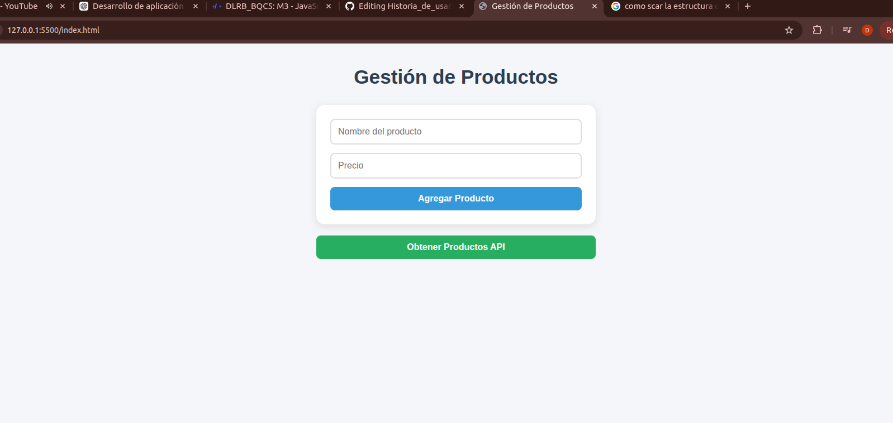

# Creación de un sistema interactivo de mensajes


-------------------------------------------------------------------------

## 📌 Descripcion

El software valida que cada producto tenga datos correctos, el sistema utiliza un Objeto para almacenar los detalles de los productos, un Set para filtrar códigos numéricos duplicados y un Map para clasificar los productos por categorías. Finalmente, recorre y muestra toda la información en la consola de forma limpia y ordenada utilizando diferentes tipos de bucles modernos (for...in, for...of y forEach).

------------------------------------------------------------------------

## 🚀 ¿Cómo acceder al proyecto?

Para trabajar en este proyecto, sigue estos pasos:

### 1. Clona el repositorio

``` bash

git clone -b H2 https://github.com/Dan623280/Historia_de_usario_js.git

```
------------------------------------------------------------------------
## Estructtura
.
├── gestion_datos.js
├── image.png
└── README.md

------------------------------------------------------------------------


## ▶️Ejecuta gestion_datos.js



Una vez en la rama correcta, abre el archivo "gestion_datos.js" y recorrerlo en vscode

------------------------------------------------------------------------

##  ▶️ Lo que podemos ver en el programa

1. Creación del objeto de productos.
2. Uso de Set en JavaScript.
3. Creación de un Map.
4. Iteración sobre las estructuras de datos.
5. Validación y pruebas.


------------------------------------------------------------------------
## 👤 author

Daniel Elias Alvarez Diaz

------------------------------------------------------------------------

## 🔗 Repository

👉 https://github.com/Dan623280/Historia_de_usario_js.git